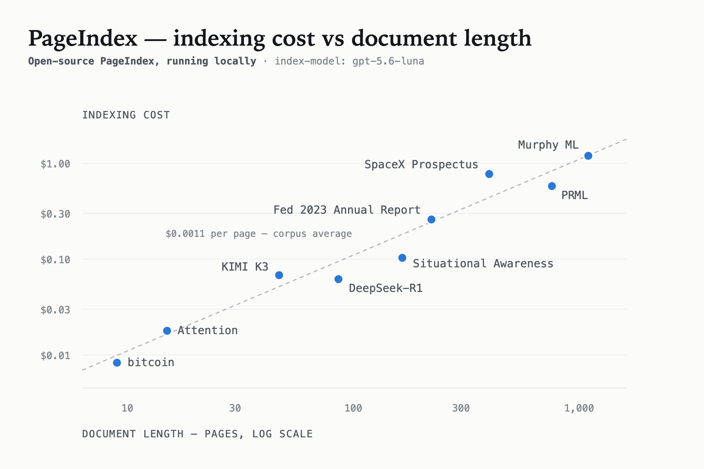
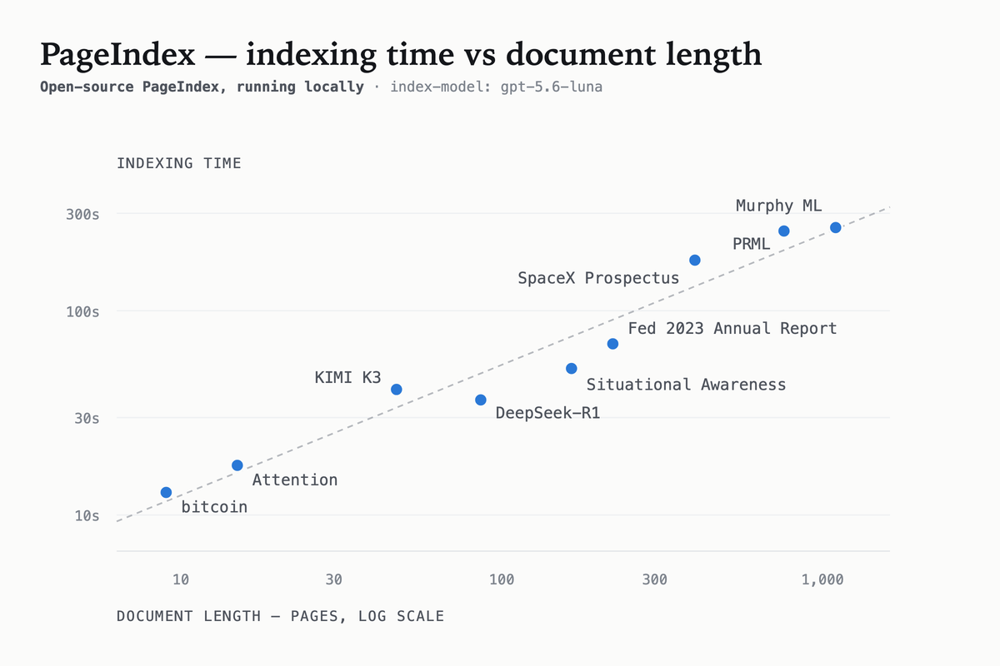
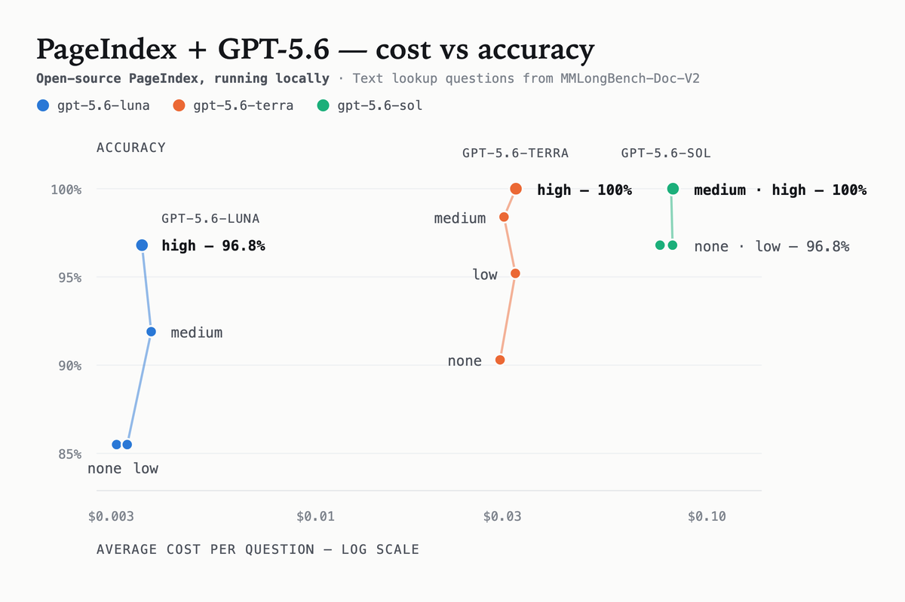

<div align="center">
  
<a href="https://vectify.ai/pageindex" target="_blank">

</a>

<br/>
<br/>

<p align="center">
  <a href="https://trendshift.io/repositories/14736" target="_blank"></a>
</p>

# PageIndex: Vectorless, Reasoning-based RAG

<p align="center"><b>Reasoning-based RAG&nbsp; ◦ &nbsp;No Vector DB, No Chunking&nbsp; ◦ &nbsp;Context-Aware Retrieval&nbsp; ◦ &nbsp;Reads Like a Human</b></p>

<h4 align="center">
  <a href="https://vectify.ai">🌐 Website</a>&nbsp; • &nbsp;
  <a href="https://chat.pageindex.ai">🖥️ Chat Platform</a>&nbsp; • &nbsp;
  <a href="https://pageindex.ai/developer">🔌 MCP & API</a>&nbsp; • &nbsp;
  <a href="https://docs.pageindex.ai">📖 Docs</a>&nbsp; • &nbsp;
  <a href="https://pageindex.ai/blog">📝 Blog</a>&nbsp; • &nbsp;
  <a href="https://ii2abc2jejf.typeform.com/to/tK3AXl8T">✉️ Contact</a>&nbsp;
</h4>
  
</div>


<details open>
<summary><h2>Updates</h2></summary>

- [Aug '26] 🔥 [**PageIndex SDK**](#quickstart): `pip install -U pageindex` now ships **local mode**: index, retrieve, and chat entirely on your machine with your own LLM key, or point the same client at PageIndex Cloud with an API key.
- [Aug '26] ⚡ [**PageIndex Flash**](#step-2-build-the-tree-index): tree structure generation from PDFs in seconds, with structure extracted heuristically from the document's own layout info instead of built by an LLM.
- [Scale PageIndex to Millions of Documents](https://pageindex.ai/blog/pageindex-filesystem): *PageIndex File System* is a file-level tree indexing layer that lets PageIndex reason over an entire corpus, not just a single document.
- [PageIndex Chat](https://chat.pageindex.ai): a human-like document analysis agent for long professional documents.<!-- Also available via [MCP](https://pageindex.ai/developer) or [API](https://pageindex.ai/developer). -->

</details>


# What is PageIndex?

Are you frustrated with vector database retrieval accuracy for long and complex documents? Vector-based RAG retrieves by semantic **similarity**. But **similarity ≠ relevance** — what retrieval actually needs is relevance, and relevance requires **reasoning**. On professional documents that demand contextual understanding, domain expertise, and multi-step reasoning, similarity search misses what is relevant but not similar, and returns what is similar but not relevant.

Inspired by AlphaGo, **[PageIndex](https://vectify.ai/pageindex)** replaces the vector index with a **hierarchical tree index** and lets an LLM **reason** its way through it, the way a human expert turns to and reads the right section of a long report. Retrieval happens in two steps:

1. **Index**: generate a **tree-structure index** for each document
2. **Retrieve**: agentically **search that tree** with LLM reasoning

<div align="center">
  <a href="https://pageindex.ai/blog/pageindex-intro" target="_blank" title="The PageIndex Framework">
    
  </a>
</div>


### TL;DR

<blockquote>PageIndex is a <b>vectorless</b>, <b>reasoning-based RAG</b> engine that <b>mirrors how humans read</b>, delivering <b>traceable</b>, <b>explainable</b>, and <b>context-aware</b> retrieval, with <b>no vector DBs</b> or <b>chunking</b>.</blockquote>

### Compare with Vector RAG

| | Vector RAG | **PageIndex** |
|---|---|---|
| **Index** | vector index | tree index |
| **Unit** | fixed-size chunks | natural sections |
| **Retrieval** | semantic similarity search | LLM reasoning over the tree |
| **Result** | opaque, “vibe retrieval” | traceable to explicit references |
| **Context** | query embedding only | full context: conversation history, domain knowledge, etc. |

It is ideal for financial reports, legal documents, regulatory filings, technical manuals, medical literature, academic textbooks, and any other long, complex professional document.

> PageIndex achieved **state-of-the-art** [98.7% accuracy](https://github.com/VectifyAI/Mafin2.5-FinanceBench) on FinanceBench (financial document QA benchmark), vastly outperforming vector-based RAG (see [Benchmarks](#leading-accuracy-on-financebench)).


# Quickstart

```bash
pip install -U pageindex
```


```python
import os
from pageindex import PageIndexClient

os.environ["OPENAI_API_KEY"] = "your-openai-key"

client = PageIndexClient(
    index="gpt-5.6-luna",               # model to build the tree index
    chat="gpt-5.6-sol",                 # model to search the tree
)
doc_id = client.submit_document("report.pdf")["doc_id"]

answer = client.chat("What was the 2023 operating margin, and where is it stated?",
                     doc_id=doc_id)
print(answer)
```

### Model Recommendations

- **`index=`: a basic model is sufficient.** The index model generates the document's tree index. A basic model is sufficient to produce a good tree structure.
- **`chat=`: use the best model you can afford.** The chat model searches the tree to retrieve information. See [Query cost and accuracy](#query-cost-and-accuracy).

See the [SDK client usage guide](#a-use-pageindex-through-the-sdk-client) to configure other models and more, or [integrate PageIndex with your own agent](#b-integrate-pageindex-with-your-own-agent).

### Get Answers with Citations

To request inline page-level citations, pass a system message together with the question:

```python
messages = [
    {"role": "system", "content": """Cite only statements supported by tool outputs
        using <cite doc="{docName}" page="{pageNumber}"/>"""},
    {"role": "user", "content": "Summarize the document."},
]

answer = client.chat(messages, doc_id=doc_id)
```

The model fills in the document name and page number, for example:

```text
Revenue increased during the reporting period. <cite doc="report.pdf" page="12"/>
```


# Usage Guide

Two ways to use PageIndex: (a) directly through the SDK client, or (b) integrate it into your own agent.

### (a) Use PageIndex through the SDK client

End to end in three steps: set up, index, ask. Expand a step below for its full options.

<details>
<summary><b>⚙️ Step 1: Initialize the client</b></summary>
<br>

Create a local client and choose the models used for indexing and retrieval:

```python
from pageindex import PageIndexClient
import os

client = PageIndexClient(
    index_model="gpt-5.6-luna",
    chat_model="gpt-5.6-sol",
    storage_path=".pageindex",
)
```

- **`index_model`** builds the tree index. A basic model is sufficient.

- **`chat_model`** searches the tree and answers questions. Use the best model you can afford.

- **`storage_path`** specifies where indexed documents are stored locally.

`index_model=` / `chat_model=` are the flat spellings of the quickstart's `index=` / `chat=`; either spelling works.

#### Model naming conventions

Model names follow [LiteLLM's naming convention](https://docs.litellm.ai/docs/providers). Choose the format that matches your provider:

**OpenAI**: use the model name directly and set `OPENAI_API_KEY`:

```python
os.environ["OPENAI_API_KEY"] = "your-openai-api-key"
chat_model = "gpt-5.6-sol"
```

**Anthropic**: prefix the model name with `anthropic/` and set `ANTHROPIC_API_KEY`:

```python
os.environ["ANTHROPIC_API_KEY"] = "your-anthropic-api-key"
chat_model = "anthropic/claude-sonnet-4-6"
```

**OpenRouter**: prefix the provider and model name with `openrouter/` and set `OPENROUTER_API_KEY`:

```python
os.environ["OPENROUTER_API_KEY"] = "your-openrouter-api-key"
chat_model = "openrouter/anthropic/claude-sonnet-4-6"
```

For model names and API key settings for other providers, see the [LiteLLM provider documentation](https://docs.litellm.ai/docs/providers).

</details>
<br>

<details>
<summary><a id="step-2-build-the-tree-index"></a><b>🌲 Step 2: Build the tree index</b></summary>
<br>

`submit_document` defaults to **Flash** indexing: the structure is extracted from the PDF's own layout (no LLM), and a model is called only for node summaries and the tree-optimization expansion pass. It takes seconds.

```python
doc_id = client.submit_document("report.pdf")["doc_id"]
```

Inspect what you got:

```python
tree = client.get_document_structure(doc_id)    # titles, page ranges, summaries; no text
client.list_documents()                         # everything you have indexed
```

A PageIndex tree looks like a table of contents optimized for LLMs and agents:

```jsonc
{
  "title": "Financial Stability",
  "node_id": "0006",
  "start_index": 21,
  "end_index": 22,
  "summary": "The Federal Reserve ...",
  "nodes": [
    {
      "title": "Monitoring Financial Vulnerabilities",
      "node_id": "0007",
      "start_index": 22,
      "end_index": 28,
      "summary": "The Federal Reserve's monitoring ..."
    },
    {
      "title": "Domestic and International Cooperation and Coordination",
      "node_id": "0008",
      "start_index": 28,
      "end_index": 31,
      "summary": "In 2023, the Federal Reserve collaborated ..."
    }
  ]
}
```

See more example [documents](https://github.com/VectifyAI/PageIndex/tree/main/examples/documents) and generated [tree structures](https://github.com/VectifyAI/PageIndex/tree/main/examples/documents/results).

</details>
<br>

<details>
<summary><b>💬 Step 3: Ask questions</b></summary>
<br>

`chat()` is the one-line surface. Underneath it is a document-QA agent, and you can talk to it over whichever protocol your stack already speaks:

**Get a simple answer with `chat()`:**

```python
client.chat("What changed in the risk factors?", doc_id=doc_id)
```

Pass a string or role/content history and get the answer back.

**Stream the answer:**

```python
client.chat("...", doc_id=doc_id, stream=True)
```

Returns the answer as text chunks.

**Use the OpenAI Chat Completions format:**

```python
client.chat_completions(messages, doc_id=doc_id)
```

Returns the full envelope, including token usage, streaming metadata, and `finish_reason`.

**Use the OpenAI Responses format:**

```python
client.responses("...", doc_id=doc_id, reasoning={"effort": "high"})
```

Returns the agent's process transcript in `items`. Append those items to the next call's `input` to preserve memory and benefit from provider prompt caching. This requires a Responses-compatible backend in local mode.

**Use the Anthropic Messages format:**

```python
client.messages("...", model="claude-sonnet-4-6", doc_id=doc_id)
```

Uses Anthropic's native Messages API and tool runner. Install it with `pip install 'pageindex[anthropic]'`.

Pass a list of ids to `doc_id` to search several documents at once, and keep it identical across a conversation's calls.

</details>

### (b) Integrate PageIndex with your own agent

PageIndex can also be integrated into your own agent. Each example below covers a different framework:

<details>
<summary><b>OpenAI Agents SDK</b></summary>
<br>

Ships with the SDK, no extras needed:

```python
from agents import Agent, Runner

agent = Agent(**client.openai_agent_config(doc_id=doc_id))
result = Runner.run_sync(agent, "Summarize the auditor's concerns.")
print(result.final_output)
```

`openai_agent_config()` returns the instructions and tools an `Agent` needs. To use your own prompt or pick tools yourself, assemble the pieces directly:

```python
agent = Agent(
    name="PageIndex",
    instructions=client.agent_instructions(doc_id=doc_id),   # or your own prompt
    tools=client.as_openai_tools(doc_id=doc_id),              # include_management=True adds deletion
    model=client.chat_model,                                  # local clients only
)
```

</details>
<br>

<details>
<summary><b>Anthropic SDK tool runner</b></summary>
<br>

Install with `pip install 'pageindex[anthropic]'`:

```python
import anthropic

runner = anthropic.Anthropic().beta.messages.tool_runner(
    **client.anthropic_runner_config(model="claude-sonnet-4-6", doc_id=doc_id),
    messages=[{"role": "user", "content": "Summarize the auditor's concerns."}],
)
final = runner.until_done()
print(final.content[-1].text)
```

`anthropic_runner_config()` fills every `tool_runner` slot except `messages`. The explicit form:

```python
runner = anthropic.Anthropic().beta.messages.tool_runner(
    model="claude-sonnet-4-6",
    max_tokens=8192,
    system=client.agent_instructions(doc_id=doc_id),
    tools=client.as_anthropic_tools(doc_id=doc_id),   # asynchronous=True for AsyncAnthropic
    max_iterations=10,
    messages=[{"role": "user", "content": "Summarize the auditor's concerns."}],
)
```

</details>
<br>

<details>
<summary><b>Claude Agent SDK</b></summary>
<br>

Install with `pip install 'pageindex[claude]'`. The Claude Agent SDK is async-native:

```python
from claude_agent_sdk import ClaudeAgentOptions, ResultMessage, query

options = ClaudeAgentOptions(**client.claude_agent_config(doc_id=doc_id))
async for message in query(prompt="Summarize the auditor's concerns.", options=options):
    if isinstance(message, ResultMessage):
        print(message.result)
```

`claude_agent_config()` supplies the system prompt, the PageIndex MCP server, and its tool pre-approval. The explicit form:

```python
options = ClaudeAgentOptions(
    system_prompt=client.agent_instructions(doc_id=doc_id),
    mcp_servers={"pageindex": client.as_claude_mcp(doc_id=doc_id)},
    allowed_tools=["mcp__pageindex"],
)
```

</details>
<br>

<details>
<summary><b>Other agent frameworks</b></summary>
<br>

```python
tools = client.agent_tools(doc_id=doc_id)   # plain functions returning JSON
```

`agent_tools()` returns plain Python functions that work with LangChain, PydanticAI, and any other agent framework.

Every helper above accepts `doc_id=` to point the agent at specific documents and `include_management=True` to also expose document deletion (off by default). Locally, `doc_id` is enforced at the tool layer, not just prompted: out-of-scope lookups return `NOT_FOUND`.

</details>


# Benchmarks

### Running PageIndex locally

#### Indexing cost and time

Building a tree locally runs **about $0.001 per page** with `gpt-5.6-luna` as the index model, so a 1,000-page textbook costs a little over a dollar and a few minutes, once, and every later question reuses it. PageIndex is designed not to rely heavily on the model used at index time, so in our experiments a basic model does not hurt quality.

<div align="center">
<picture>
  <source media="(prefers-color-scheme: dark)" srcset="assets/index-cost-dark.png">
  
</picture>
</div>

Indexing time also scales predictably with document length. In the same local setup, the benchmark documents (9 to 1,098 pages) finished in roughly **13 seconds to 4.5 minutes**.

<div align="center">
<picture>
  <source media="(prefers-color-scheme: dark)" srcset="assets/index-time-dark.png">
  
</picture>
</div>


#### Query cost and accuracy

[**PageIndex-OSS-Benchmark**](https://github.com/VectifyAI/PageIndex-OSS-Benchmark) measures exactly the setup in the quickstart above (`PageIndexClient()` in local mode, flash indexing, no OCR) on 62 lookup questions over 34 PDFs (1,945 pages) drawn from [MMLongBench-Doc-V2](https://github.com/VectifyAI/MMLongBench-Doc-V2). Every question's answer is a fact stated in running text, so a wrong answer is a **retrieval or reading failure**, not a reasoning one.

<div align="center">
<picture>
  <source media="(prefers-color-scheme: dark)" srcset="assets/results-dark.png">
  
</picture>
</div>


Full results, data, and the runner are in the [benchmark repo](https://github.com/VectifyAI/PageIndex-OSS-Benchmark).

### Leading accuracy on FinanceBench

PageIndex reached a state-of-the-art [**98.7% accuracy**](https://vectify.ai/blog/Mafin2.5) on [FinanceBench](https://arxiv.org/abs/2311.11944) (financial document QA benchmark), vastly outperforming vector-based RAG.

<div align="center">
  <a href="https://github.com/VectifyAI/Mafin2.5-FinanceBench">
    
  </a>
</div>

Explore the full FinanceBench [evaluation results](https://github.com/VectifyAI/Mafin2.5-FinanceBench) and the [blog post](https://vectify.ai/blog/Mafin2.5).


# PageIndex Cloud

The open-source version is ideal for text-heavy PDFs and local workflows. With **PageIndex Cloud, document indexing and storage run in the cloud**: PageIndex handles parsing, OCR, image understanding, tree-index construction, and managed storage for you. The chat and retrieval layer remains **compatible with your model**, so you can search the cloud-hosted index using the model provider your application already uses.

Moving indexing and storage from Local to Cloud only requires a [PageIndex API key](https://developer.pageindex.ai/):

```python
import os
from pageindex import PageIndexClient

os.environ["PAGEINDEX_API_KEY"] = "your-pageindex-key"
os.environ["OPENAI_API_KEY"] = "your-openai-key"

client = PageIndexClient(
    index="cloud",                       # build and store the index in PageIndex Cloud
    chat="gpt-5.6-sol",                  # use your preferred compatible model for chat
)

# The rest of your code stays the same (wait=True: cloud indexing is asynchronous)
doc_id = client.submit_document("report.pdf", wait=True)["doc_id"]
print(client.chat("What was the 2023 operating margin?", doc_id=doc_id))
```

| Capability | **Local** (this repo) | **Cloud** ([get an API key](https://developer.pageindex.ai/)) |
|---|---|---|
| Best for | text-heavy PDFs and local workflows | scanned, image-heavy, and large document collections |
| Indexing | runs locally | runs in PageIndex Cloud, with production OCR and image understanding |
| Storage | local | managed in PageIndex Cloud |
| Chat model | your model | your model, or the managed chat included with your key |
| Citations | page-level | line-level |
| Image understanding | — | ✅ |
| Multi-document scale | manual | PageIndex File System |
| MCP server | — | ✅ |

### More About PageIndex Cloud

- [Scale PageIndex to Millions of Documents](https://pageindex.ai/blog/pageindex-filesystem): **PageIndex File System** is a Cloud-only, file-level tree indexing layer that lets PageIndex reason over an entire corpus, not just a single document.

### Ready to Try It?

- Get a [PageIndex API key](https://developer.pageindex.ai/)
- Read the [PageIndex Cloud documentation](https://docs.pageindex.ai/)

For dedicated deployment (VPC or on-premises), [contact us](https://ii2abc2jejf.typeform.com/to/gVv7qkaN) or [book a demo](https://calendly.com/pageindex/meet).


---

# ⭐ Support Us

Leave us a star 🌟 if you like our project. Thank you!  

<p>
  
</p>

Please cite this work as:
```
Mingtian Zhang, Yu Tang and PageIndex Team,
"PageIndex: Next-Generation Vectorless, Reasoning-based RAG",
PageIndex Blog, Sep 2025.
```

<details>
<summary>Or use the BibTeX citation.</summary>

```bibtex
@article{zhang2025pageindex,
  author = {Mingtian Zhang and Yu Tang and PageIndex Team},
  title = {PageIndex: Next-Generation Vectorless, Reasoning-based RAG},
  journal = {PageIndex Blog},
  year = {2025},
  month = {September},
  note = {https://pageindex.ai/blog/pageindex-intro},
}
```
</details>


### Connect with Us

<div align="center">

[](https://pageindex.ai)&nbsp;
[](https://x.com/PageIndexAI)&nbsp;
[](https://www.linkedin.com/company/vectify-ai/)&nbsp;
[](https://discord.com/invite/VuXuf29EUj)&nbsp;
[](https://calendly.com/pageindex/meet)&nbsp;
[](https://ii2abc2jejf.typeform.com/to/tK3AXl8T)

</div>

---

© 2026 [Vectify AI](https://vectify.ai)
